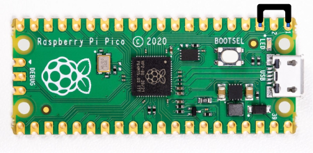
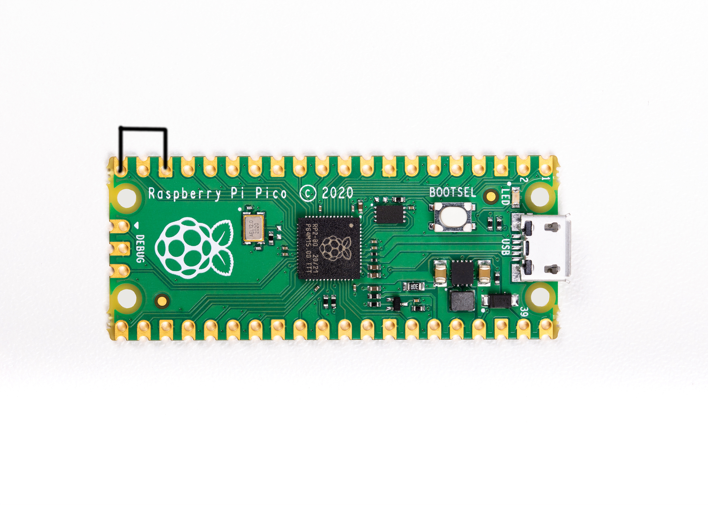

<h1 align="center">🦆 pico-ducky</h1>

<p align="center">
  
</p>

<p align="center">Turn a Raspberry Pi Pico into a USB Rubber Ducky using CircuitPython.</p>

<p align="center">
  
  
  
  
</p>

<p align="center">
  <a href="#quick-start">🚀 Quick Start</a> •
  <a href="#full-install-instructions">🛠️ Full Install</a> •
  <a href="#changing-keyboard-layouts">⌨️ Keyboard Layouts</a> •
  <a href="#resources">📚 Resources</a>
</p>

---

## 📖 Table of Contents

- [Quick Start](#quick-start)
- [Full Install Instructions](#full-install-instructions)
- [Pico W Web Service](#pico-w-web-service)
- [Setup Mode](#setup-mode)
- [USB Enable/Disable Mode](#usb-enabledisable-mode)
- [Multiple Payloads](#multiple-payloads)
- [Changing Keyboard Layouts](#changing-keyboard-layouts)
- [Recovery](#recovery)
- [Resources](#resources)
- [Related Projects](#related-projects)

---

## 🚀 Quick Start

Get a Pico-Ducky running in under 5 minutes.

> ⚡ **Fast fact:** a $5 microcontroller + a few Python files = a fully programmable HID injection tool. No proprietary hardware required.

> ⚠️ **Use responsibly.** Only run payloads on devices you own or have explicit permission to test. This project is for security research, red-teaming, and education.

1. Download the latest release from the [Releases page](https://github.com/dbisu/pico-ducky/releases).
2. Hold the **BOOTSEL** button while plugging the Pico into a USB port. It will mount as a drive named `RPI-RP2`.
3. Flash CircuitPython for your board by copying the matching `.uf2` file to `RPI-RP2`:

   | Board | Firmware |
   |---|---|
   | Pico | `adafruit-circuitpython-raspberry_pi_pico-en_US-10.0.3.uf2` |
   | Pico W | `adafruit-circuitpython-raspberry_pi_pico_w-en_US-10.0.3.uf2` |
   | Pico 2 | `adafruit-circuitpython-raspberry_pi_pico2-en_US-10.0.3.uf2` |
   | Pico 2 W | `adafruit-circuitpython-raspberry_pi_pico2_w-en_US-10.0.3.uf2` |

   The board reboots and reconnects as `CIRCUITPY`.

4. Copy the `lib` folder to the root of `CIRCUITPY`.
5. Copy all `*.py` files to the root of `CIRCUITPY`.
6. Enter [Setup Mode](#setup-mode) to safely load your payload.
7. Copy your payload script to `CIRCUITPY` as `payload.dd`.
8. Unplug the device, remove the setup jumper, and you're ready to go.

---

## 🛠️ Full Install Instructions

A more detailed walkthrough for a from-scratch setup.

<details>
<summary>🤔 <b>Quick Start vs Full Install — which one do I need?</b></summary>
<br>

Use **Quick Start** if you just downloaded a release zip and want to flash it fast.
Use **Full Install** if you're cloning the repo, building from source, or want to understand every file being copied.
</details>
<br>

1. **Clone the repo:**
   ```bash
   git clone https://github.com/dbisu/pico-ducky.git
   ```

2. **Download CircuitPython** (v10.0.3) for your board:
   - [Pico](https://circuitpython.org/board/raspberry_pi_pico/)
   - [Pico W](https://circuitpython.org/board/raspberry_pi_pico_w/)
   - [Pico 2](https://circuitpython.org/board/raspberry_pi_pico2/)
   - [Pico 2 W](https://circuitpython.org/board/raspberry_pi_pico2_w/)

3. Hold **BOOTSEL** and plug in the Pico — it appears as `RPI-RP2`.

4. Copy the downloaded `.uf2` file to `RPI-RP2`. The device reboots and reconnects as `CIRCUITPY`.

5. Download the [Adafruit CircuitPython Bundle](https://github.com/adafruit/Adafruit_CircuitPython_Bundle/releases/latest) (`adafruit-circuitpython-bundle-10.x-mpy-YYYYMMDD.zip`) and extract it.

6. From the extracted bundle's `lib` folder, copy `adafruit_hid` to your Pico's `lib` folder.

7. Copy `adafruit_debouncer.mpy` and `adafruit_ticks.mpy` to the Pico's `lib` folder.

8. Copy `asyncio` to the Pico's `lib` folder.

9. Copy `adafruit_wsgi` to the Pico's `lib` folder.

10. Copy `boot.py` from the cloned repo to the root of the Pico.

11. Copy `duckyinpython.py`, `code.py`, `pins.py`, `webapp.py`, and `wsgiserver.py` to the root of the Pico.

12. **Pico W only** — create `secrets.py` in the root with your access point credentials:
    ```python
    secrets = { 'ssid' : "BadAPName", 'password' : "badpassword" }
    ```

13. Get a payload script from the [Hak5 payloads repo](https://github.com/hak5/usbrubberducky-payloads) or [write your own](https://docs.hak5.org/hak5-usb-rubber-ducky/ducky-script-basics/hello-world), then save it as `payload.dd` on the Pico. Note: pico-ducky currently supports DuckyScript 1.0 and partial 3.0 support.

14. ⚠️ If the device is **not** in setup mode, it will reboot and execute the script after about half a second.

15. **Note:** the Pico W does not appear as a USB drive by default.

---

## 🌐 Pico W Web Service

The Pico W broadcasts its own access point, defaulting to `192.168.4.1`. The web interface is available at:

```
http://192.168.4.1:80
```

**Web routes:**
```
/
/new
/ducky
/edit/<filename>
/write/<filename>
/run/<filename>
```

**API endpoint:**
```
/api/run/<filenumber>
```

---

## 🔧 Setup Mode

Setup mode prevents the payload from firing while you're editing it.

Connect a jumper wire between **pin 1 (`GP0`)** and **pin 3 (`GND`)**.

<p align="center">
  
  <br>
  <sub>📌 Jumper between GP0 and GND</sub>
</p>

---

## 🕵️ USB Enable/Disable Mode

For stealth, you can disable the Pico's USB mass-storage drive so it doesn't show up when plugged into a target machine.

1. Enter setup mode.
2. Copy your payload script to the device.
3. Disconnect from your host PC.
4. Connect a jumper between **pin 18 (`GND`)** and **pin 20 (`GPIO15`)**.
5. To reprogram later, remove the jumper and reconnect to your PC.

<p align="center">
  
  <br>
  <sub>📌 Jumper between GND (pin 18) and GPIO15 (pin 20)</sub>
</p>

**Defaults:**
- **Pico:** USB mass storage **enabled**
- **Pico W:** USB mass storage **disabled**

---

## 🎯 Multiple Payloads

You can store several payloads on the device and select one by grounding a specific pin:

| Pin | Payload |
|---|---|
| GP4 | `payload.dd` |
| GP5 | `payload2.dd` |
| GP10 | `payload3.dd` |
| GP11 | `payload4.dd` |

---

## ⌨️ Changing Keyboard Layouts

*Adapted from [Neradoc/Circuitpython_Keyboard_Layouts](https://github.com/Neradoc/Circuitpython_Keyboard_Layouts/blob/main/PICODUCKY.md)*

### 1. Check if your layout is available

Visit the [latest release page](https://github.com/Neradoc/Circuitpython_Keyboard_Layouts/releases/latest) and look for your language.

- **If found:** download the `py` zip — `circuitpython-keyboard-layouts-py-XXXXXXXX.zip`.
  - The `.mpy` version also works and saves space/memory, but isn't necessary on a Pico.
- **If not found:** use the [online generator](https://www.neradoc.me/layouts/) to build a custom bundle.

### 2. Copy the layout files

From the zip's `lib` folder, copy these two files (replacing `LANG` with your language code) into the board's `lib` directory:

- `keyboard_layout_win_LANG.py`
- `keycode_win_LANG.py`

> **Do not** modify the `adafruit_hid` directory or rename these files — place them directly in `lib`.

You'll also need the [adafruit_hid library](https://github.com/adafruit/Adafruit_CircuitPython_HID/releases/latest).

Example layout for French:


### 3. Update the code

Comment out the default (US) layout imports at the top of the file:

```python
# from adafruit_hid.keyboard_layout_us import KeyboardLayoutUS as KeyboardLayout
# from adafruit_hid.keycode import Keycode
```

Uncomment and edit the alternate-layout imports, replacing `LANG` with your language code:

```python
from keyboard_layout_win_LANG import KeyboardLayout
from keycode_win_LANG import Keycode
```

**Example — German (`de`):**

```python
from keyboard_layout_win_de import KeyboardLayout
from keycode_win_de import Keycode
```

Copy `keyboard_layout_win_de.mpy` and `keycode_win_de.mpy` into `/lib`:

```
adafruit_hid/
keyboard_layout_win_de.mpy
keycode_win_de.mpy
```

---

## 🩹 Recovery

If your Pico becomes corrupted or won't boot, see [RESET.md](RESET.md).

---

## 📚 Resources

**Tools**
- [PicoDuckyBuilder](https://github.com/ryo-yamada/PicoDuckyBuilder) by [ryo-yamada](https://github.com/ryo-yamada) — converts a blank Pico into a ducky.

**Documentation**
- [CircuitPython Docs](https://docs.circuitpython.org/en/latest/README.html)
- [CircuitPython HID Guide](https://learn.adafruit.com/circuitpython-essentials/circuitpython-hid-keyboard-and-mouse)
- [Ducky Script Reference](https://github.com/hak5darren/USB-Rubber-Ducky/wiki/Duckyscript)

**Video Tutorials**
- [pico-ducky tutorial — NetworkChuck](https://www.youtube.com/watch?v=e_f9p-_JWZw)
- [USB Rubber Ducky playlist — Hak5](https://www.youtube.com/playlist?list=PLW5y1tjAOzI0YaJslcjcI4zKI366tMBYk)
- [CircuitPython on the Raspberry Pi Pico — DroneBot Workshop](https://www.youtube.com/watch?v=07vG-_CcDG0)

---

## 🔗 Related Projects

- [Defcon31-ducky](https://github.com/iot-pwn/defcon31-ducky)

---

<p align="center">
  <sub>Made with 🦆, jumper wires, and a healthy respect for keyboards you don't own.</sub>
</p>

<p align="center">
  
  
</p>
